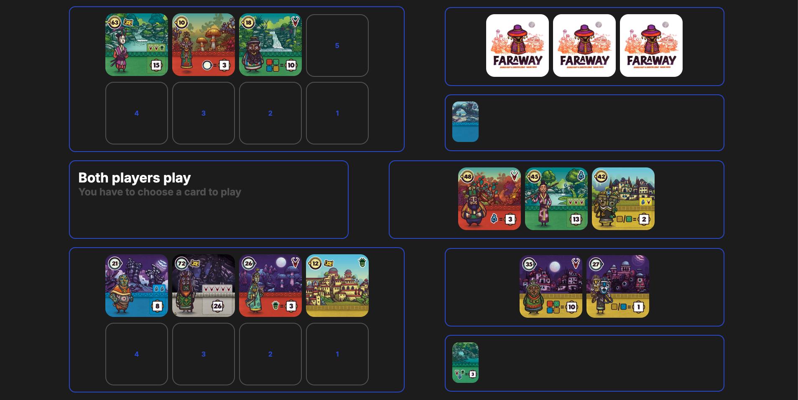

# ♠️ Faraway - Web Implementation



A web-based implementation of the card game **Faraway**.

The game was created in just **two days** as a challenge to build a functional online version as fast as possible.

## 📜 About the Game

This is a web-based adaptation of the card game **Faraway**, created by **Johannes Goupy and Corentin Lebrat**. You can find more details about the game [here](https://boardgamegeek.com/boardgame/385761/faraway) and the original card data was sourced from [this repository](https://github.com/saifahn/faraway-cards/tree/main).

## ⚙️ Project Setup

### 1️⃣ Backend Setup

The backend is a **Node.js server** that handles game logic and communication via sockets.

Install dependencies:

```bash
npm i
```

Run the backend server:

```bash
node index
```

### 2️⃣ Frontend Setup

The frontend is built with **Vue.js** and provides the game interface.

Navigate to the website folder:

```bash
cd website
```

Install dependencies:

```bash
npm i
```

Run the frontend:

```bash
npm run dev
```

This will start the web interface, accessible via a local development server.

## 📡 Communication

The project uses **WebSockets** for real-time communication between players. This ensures smooth gameplay and live updates without requiring page reloads.

## ⚠️ No Anti-Cheat Mechanism

This project does **not** include an anti-cheat system because it was designed as a private, fast prototype. However, implementing one would be straightforward by restricting some of the data sent to the client.

## 🎯 Challenge-Based Development

This game was built **in just two days** as a speed challenge to see how quickly a functional online version could be made.

## 💡 Contributions

Anyone is welcome to suggest modifications, especially to the design, which was quickly done.

## ✨ Creator & Contributors

This project was created by [Maximus220](https://github.com/Maximus220).

Enjoy the game! 🎴


